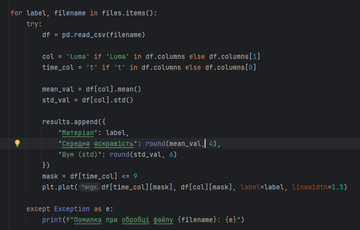

# Практична робота №6
Цей репозиторій cтворений для перегляду виконання практичної роботи №6 з дисципліни "Технології збору та обробки даних", виконане студентом Щур Р.І., групи ТВ-32.

## Мета роботи:
За допомогою обраного мобільного додатку зібрати реальні дані з сенсору вашого телефону, обробити та провести їхній аналіз
## Поставлене завдання:
Вивчення ефективності різних матеріалів для затемнення на рівень освітленості. Потрібно порівняти рівень освітленості при використанні різних матеріалів для затемнення (штори, плівки, жалюзі). Обробка даних включає порівняння результатів для різних типів матеріалів.

## Технічна Реалізація:

Для фіксації результатів рівня затемненості різних матеріалів було використано мобільний застосунок Phyphox, а саме режим Brightness (Luminance). У ролі технічного обладнання використовувався смартфон iPhone XR. Експеримент проводився в замкнутому приміщенні зі статичним освітленням, для мінімізації впливу зовнішніх чинників та зменшення рівня «шуму» в даних.  Дослідження охоплювало чотири типи матеріалів:сонцезахисне скло, аркуш паперу, щільний шматок тканини,  фрагмент пластикового прозорого ZIP-пакета.  Для забезпечення точності пристрій був статично закріплений в одному положенні протягом усього процесу. Усі заміри тривали однакову кількість часу — 10 секунд. Для подальшого порівняння та об’єктивного аналізу результатів було проведено контрольний замір рівня освітленості без використання будь-яких сторонніх предметів. 

## Програмна Реалізація:

Результати замірів формувались у форматі CSV, файл складається з таких значень:

t (Time) — час у секундах, що пройшов від початку запису
Luma — відносна цифрова яскравість (значення від 0 до 1)
Luminance — фотометрична яскравість, розрахована додатком на основі фізичних параметрів оптик
Shutter Speed (s) — швидкість затвора (витримка) камери в секундах. Цей параметр змінювався автоматично (автоекспозиція) залежно від щільності матеріалу 
Aperture (f/N) — діафрагмове число (відносний отвір об'єктива)
ISO — світлочутливість матриці

